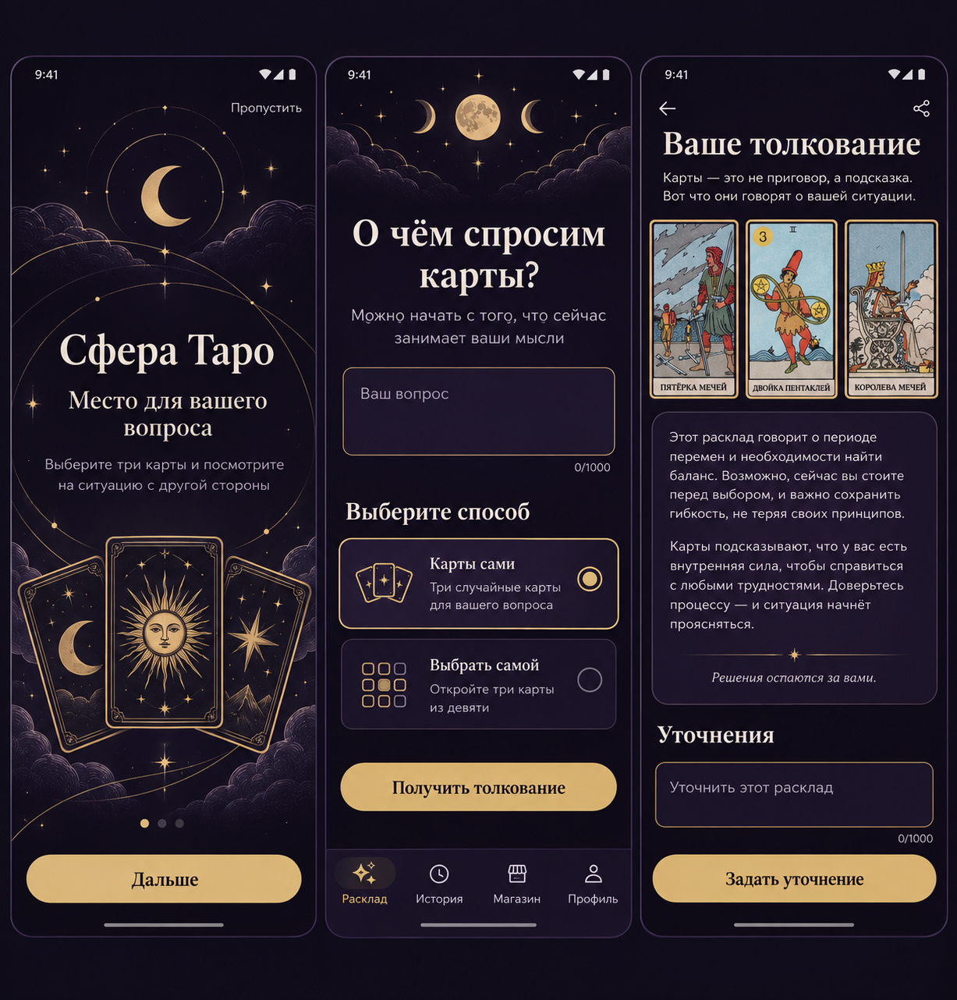
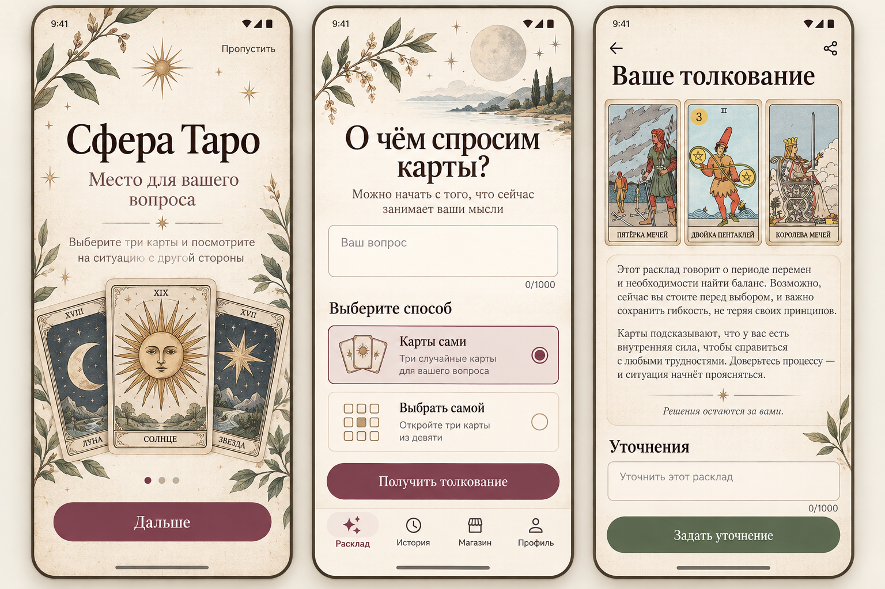
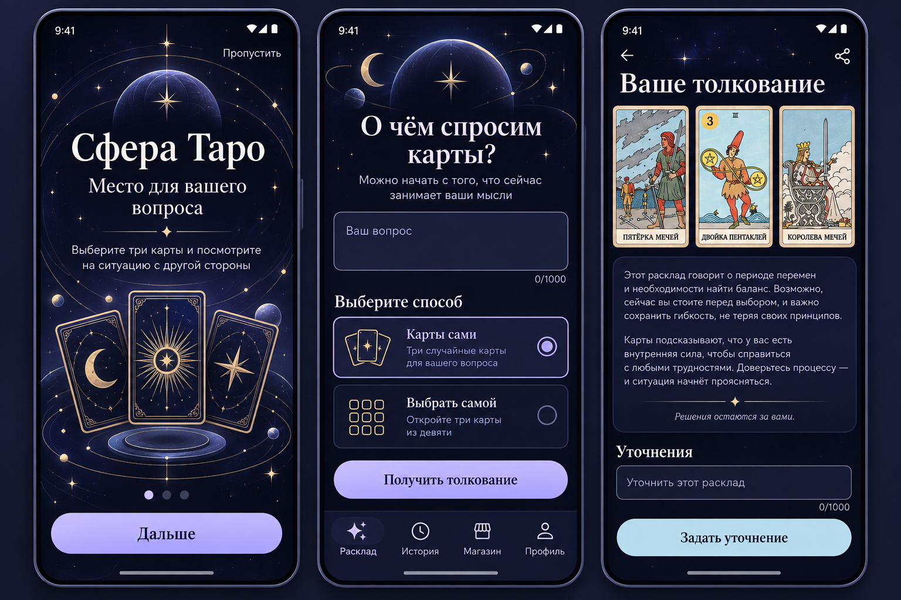

# Редизайн Android-приложения «Сфера Таро»

Дата аудита и начала реализации: **22 сентября 2026 года**.

Редизайн выполняется поверх работающего MVP. Гостевая сессия, API, история, лимиты и безопасный повтор запроса не меняются. Пользователь выбрал направление **«Тихая мастерская»**. Вертикальный срез «онбординг → вопрос и выбор карт → результат и уточнения» реализован; следующая проверка выполняется на телефоне.

## Концепции

### 1. Лунный атлас

Чернильный фон, сливовые поверхности, айвори, матовое золото и тонкая орбитальная графика. Длинное толкование оформляется как спокойная журнальная страница. Направление развивает текущую тёмную тему и требует меньше изменений поведения.

### 2. Тихая мастерская

Светлая бумага, винные действия и оливковые акценты. Самый дружелюбный и отличимый вариант, но потребует полноценной светлой темы, отдельной проверки всех контрастов и системных панелей.

**Выбрано для реализации 22 сентября.**

### 3. Орбита

Тёмно-синий фон, лаванда, ледяной голубой и современная геометрия. Выглядит технологичнее, но сложнее удержать спокойствие интерфейса и не перегрузить его свечением и декоративными слоями.

| Направление | Читаемость | Отличимость | Сложность реализации |
|---|---:|---:|---:|
| Лунный атлас | 5/5 | 4/5 | Средняя |
| Тихая мастерская | 5/5 | 5/5 | Средняя |
| Орбита | 4/5 | 4/5 | Выше средней |

Макеты фиксируют композицию, иерархию и настроение. Текст, поля, кнопки, навигация и карты реализуются нативными Compose-компонентами; изображения макетов не встраиваются как готовые экраны.

## Аудит текущего интерфейса

- Один `DeckCard` используется для блоков разного смысла и делает все уровни одинаково тяжёлыми.
- Часть `TextStyle` содержит фиксированные цвета и может игнорировать цвет контекста компонента.
- Для `FilterChip` не определены все состояния, поэтому часть цветов приходит из Material по умолчанию.
- Онбординг оставляет много пустого места и содержит устаревшую фразу о будущем экране расклада.
- На рубашке карты осталось английское `tarot sphere`.
- Длинное толкование зажато внешними и внутренними полями карточки.
- При ручном выборе клавиатура продолжает занимать место, если не убрать фокус с вопроса.
- Системные панели не приведены к единому тёмному стилю.
- История, магазин и профиль собраны из слишком похожих прямоугольных блоков.

## Реализация «Тихой мастерской»

В первой итерации готовы:

- полноценная светлая Material-тема и системные панели;
- бумажная, винная и оливковая палитра;
- новая типографическая шкала без фиксированных цветов в `TextStyle`;
- общие `SphereScreen`, `SphereHeader`, действия, варианты выбора, поле вопроса и статусные блоки;
- онбординг с нативной иллюстрацией колоды и актуальными текстами;
- выбор режима полноценными строками вместо `FilterChip`;
- ручная сетка, прогресс выбора и скрытие клавиатуры;
- результат с широкой областью текста и отдельными блоками уточнений;
- новая оливковая рубашка с нативным знаком сферы;
- новая launcher-иконка в стиле выбранной концепции;
- версия `0.5.0-debug` (`versionCode = 2`) для установки поверх предыдущего APK.

`scripts/check_android.sh` проходит: APK собран, 17 тестов и Android Lint завершены успешно. История, магазин и профиль получили совместимую светлую тему, но их отдельная композиционная переработка остаётся следующей итерацией.

## Архивные токены концепции «Лунный атлас»

### Цвета

| Роль | HEX |
|---|---|
| `background` | `#100D17` |
| `surface` | `#191520` |
| `surfaceContainer` | `#231C2D` |
| `surfaceContainerHigh` | `#2C2437` |
| `onBackground`, `onSurface` | `#F5EFE5` |
| `onSurfaceVariant` | `#C4BACB` |
| `primary` | `#E2C58A` |
| `onPrimary` | `#211A13` |
| `primaryContainer` | `#3A3024` |
| `onPrimaryContainer` | `#F6DEAB` |
| `secondary` | `#C3AECF` |
| `secondaryContainer` | `#382C43` |
| `onSecondaryContainer` | `#F1E2FC` |
| `outline` | `#897C94` |
| `outlineVariant` | `#3E3448` |
| `error` | `#FFB4B8` |
| `errorContainer` | `#40212C` |
| `onErrorContainer` | `#FFDADD` |

Цвета не задаются внутри `TextStyle`. Контент получает цвет от темы или конкретного смыслового компонента.

### Типографика

- Заголовки: Noto Serif с проверенным кириллическим набором.
- Интерфейс и длинное чтение: Noto Sans.
- `displaySmall`: 32/38 sp, Serif Medium.
- `headlineMedium`: 28/34 sp, Serif Medium.
- `titleLarge`: 22/28 sp, Serif Medium.
- `titleMedium`: 17/24 sp, Sans SemiBold.
- `bodyLarge`: 17/27 sp, Sans Normal.
- `bodyMedium`: 15/22 sp, Sans Normal.
- `labelLarge`: 16/22 sp, Sans Medium.
- `labelMedium`: 13/18 sp, Sans Medium.

### Геометрия

- Поля экрана: 20 dp; максимальная ширина содержимого: 600 dp.
- Интервалы: 4, 8, 12, 16, 24, 32 и 48 dp.
- Основная кнопка: минимум 56 dp; вторичные действия: минимум 48 dp.
- Выбор режима: минимум 64 dp с заголовком и пояснением.
- Радиусы: карты 12 dp, поля и кнопки 16 dp, крупные поверхности 24 dp.
- Сетка карт: 3 колонки, промежуток 10–12 dp.
- Анимации интерфейса: 160–220 мс; переворот карты: 350–450 мс.

## Базовые Compose-компоненты

1. `SphereScreen` — фон, системные отступы, ограничение ширины и прокрутка.
2. `SphereHeader` — заголовок и короткое пояснение.
3. `PrimaryAction` и `SecondaryAction` — одинаковые размеры и состояния.
4. `ChoiceOption` — полноценная строка режима вместо растянутого `FilterChip`.
5. `QuestionField` — поле вопроса и счётчик.
6. `TarotCardBack` — нативный знак сферы/орбиты без английской надписи.
7. `SelectionProgress` — количество выбранных карт и следующая позиция.
8. `StatusPanel` — ожидание, ошибка, офлайн и безопасный повтор.
9. `ReadingBody` — широкая область длинного текста без лишней внешней рамки.
10. `FollowUpBlock`, `HistoryRow`, `BalanceSummary`, `PackageCard` — разные компоненты для разных задач.
11. `SphereNavigationBar` — собственные цвета и доступные подписи.

## Первый вертикальный срез

1. [x] Внедрить палитру, типографику и базовые компоненты.
2. [x] Согласовать светлые системные панели.
3. [x] Обновить онбординг и убрать устаревший текст.
4. [x] Переработать вопрос и выбор режима; при ручном выборе убирать фокус с поля.
5. [x] Обновить рубашку, сетку, номера и прогресс выбора.
6. [x] Переработать результат, ожидание, повтор и уточнения.
7. [x] Добавить Compose Preview для 360/412 dp и крупного шрифта; базовые подписи TalkBack заданы.
8. [x] Выполнить `scripts/check_android.sh`.
9. [ ] Проверить срез на телефоне: `fontScale` 1.0/1.3/2.0, клавиатуру, TalkBack и обе системные темы launcher.
10. [ ] После подтверждения распространить композиционную систему на историю, магазин и профиль.

## Критерии приёмки

- Текст не обрезается и сохраняет контраст во всех состояниях.
- Все зоны нажатия не меньше 48 dp.
- Основной сценарий понятен без инструкции.
- Ожидание ответа до 120 секунд не выглядит как зависание.
- Ручной выбор трёх карт читается при обычном и крупном шрифте.
- Офлайн, ошибка и повтор запроса визуально различимы.
- Минимум 5 тестировщиков самостоятельно проходят путь от онбординга до истории.

## Инструменты

- **GPT-6 Astra**: аудит, дизайн-система, UX и реализация Jetpack Compose.
- **Image generation**: концепт-макеты и отдельные декоративные ассеты.
- Финальная иконка и материалы RuStore готовятся после проверки основных экранов на телефоне.
